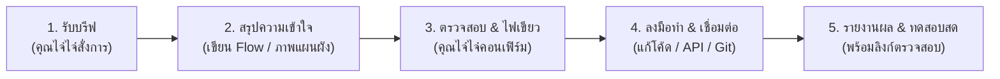

# 99 Solar Hat Yai - คู่มือข้อตกลงการทำงาน (AI & JaiJai SOP)
**บริษัท 99 แมทช์ เมคเกอร์ จำกัด • คุณไจ๋ไจ๋ (090-715-1987)**

---

## 1. บทบาทหน้าที่ (Roles & Responsibilities)

| ผู้รับผิดชอบ | บทบาท | หน้าที่หลัก |
| :--- | :--- | :--- |
| **คุณไจ๋ไจ๋** | **Product Owner & Business Director** | • กำหนดเป้าหมายและทิศทางธุรกิจ • ตัดสินใจฟังก์ชันที่ "เอา" หรือ "ไม่เอา" • ตรวจสอบความถูกต้องของสคริปต์และราคา |
| **Antigravity (AI)** | **Lead Developer & System Architect** | • ทำตามคำสั่งอย่างแม่นยำ ไม่ทำเกินคำสั่ง • สรุปความเข้าใจให้ตรงกันก่อนลงมือทำ • จัดการโค้ด, Webhook, API, Database และ Git ให้พร้อมใช้ 100% |

---

## 2. กฎเหล็กในการทำงาน (Strict Operational Rules)

1. **ห้ามตอบนอกกรอบธุรกิจโซลาร์เซลล์ (Strict Domain):**
   - บอทต้องรู้และตอบเฉพาะเรื่องโซลาร์เซลล์ของบริษัทเราเท่านั้น (ขนาด 3.3kW, 5kW, 10kW, แผง Tier 1, อินเวอร์เตอร์ กฟภ., ผ่อน 0%)
   - ห้ามมโนคำตอบ ห้ามตอบเรื่องอื่นที่ไม่เกี่ยวข้อง

2. **ระบบ 2 ห้องแชทเด็ดขาด (Dual-Room Separation):**
   - **ห้อง 1 (ห้องลูกค้า):** บอทตอบคำถาม ให้ความรู้ ส่งการ์ดราคา อัปเดตสถานะงาน
   - **ห้อง 2 (ห้องคุณไจ๋ไจ๋):** แจ้งเตือนด่วนข้ามห้องเมื่อลูกค้าให้เบอร์โทร, ขอใบเสนอราคา หรือถามคำถามนอกกรอบ

3. **เงียบทันทีเมื่อคุณไจ๋ไจ๋คุย (Silence & Human Hand-off):**
   - เมื่อเจอคำถามนอกคีย์ หรือพิมพ์ `#ปิดบอท` บอทต้องหยุดตอบทันที 12 ชั่วโมง เพื่อให้คุณไจ๋ไจ๋คุยสด โดยไม่มีข้อความบอทแทรก

4. **ตัดฟังก์ชันที่ไม่เอาทันที (No Clutter):**
   - อะไรที่คุณไจ๋ไจ๋สั่งตัด (เช่น ระบบโพสต์อัตโนมัติ) ต้องนำออกจากเมนูและหน้าจอทันที เพื่อไม่ให้รกตา

5. **ยืนยันความเข้าใจก่อนเริ่มงานใหญ่:**
   - ก่อนเขียนโค้ดฟังก์ชันใหม่ ต้องสรุปแผนภาพ หรือไดอะแกรมให้คุณไจ๋ไจ๋เห็นภาพตรงกันก่อนทุกครั้ง

---

## 3. ขั้นตอนการทำงานแบบเป็นรอบ (Workflow Pipeline)

---

## 4. มาตรฐานการส่งมอบงาน (Delivery Standard)

- ทุกโค้ดที่ทำต้อง Push ขึ้น **GitHub** และ Deploy บน **Vercel** (`https://99solar99.vercel.app`) ทันที
- มีหน้าทดสอบหรือ Dashboard หลังบ้านให้คุณไจ๋ไจ๋กดดูผลงานได้จริงเสมอ
