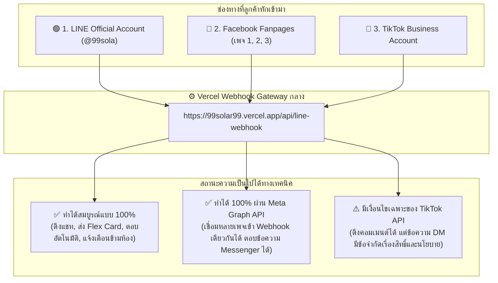

# ☀️ 99 Solar Hat Yai — Master Backend Features & Multi-Channel API Architecture
**บริษัท 99 แมทช์ เมคเกอร์ จำกัด (คุณไจ๋ไจ๋ 090-715-1987)**  
*เอกสารจัดเรียงฟังก์ชันหลังบ้านที่สมควรมี + แผนที่การเชื่อมต่อ API ข้ามช่องทาง (LINE, Facebook, TikTok)*

---

## 📌 1. จัดเรียงฟังก์ชันหลังบ้านที่ "สมควรมี" (Core Backend Features)

เพื่อให้หลังบ้านใช้งานง่าย ไม่รกตา และไม่เป็นภาระของคุณไจ๋ไจ๋ เราจัดระเบียบฟังก์ชันออกเป็น **5 ฟังก์ชันหลัก** ดังนี้:

| ลำดับฟังก์ชัน | ชื่อฟังก์ชันหลังบ้าน | หน้าที่และการทำงาน | สิ่งที่คุณไจ๋ไจ๋จะได้ประโยชน์ |
| :---: | :--- | :--- | :--- |
| **ฟังก์ชันที่ 1** | **Live Chat Inbox & Smart Alerts** (กล่องรวมแชท & แยก 3 หมวดหมู่) | รวมข้อความจากลูกค้าทุกช่องทางมาไว้ที่เดียว แสดงชัดเจนว่า *"ลูกค้าถามมาว่าไง"* พร้อมระบบพักบอทเมื่อคุณไจ๋ไจ๋เข้าคุยสด (`#ปิดบอท`) | รู้ทันทีว่าใครทักมาเรื่องอะไร ไม่ต้องสลับเปิดหลายแอป |
| **ฟังก์ชันที่ 2** | **Solar Knowledge Base Brain** (คลังสมองความรู้โซลาร์เซลล์) | หน้าจัดการคำถาม-คำตอบ (แรงดัน, ตู้ Combiner, สายไฟ PV, สเปก 5kW, ของแถม, ภาษี, ยื่น กฟภ.) เพิ่ม/ลบได้ตลอดเวลา | บอทฉลาดขึ้นเรื่อยๆ ตอบตรงเป๊ะ ไม่มโน ไม่ตอบนอกเรื่อง |
| **ฟังก์ชันที่ 3** | **Omnichannel Token Hub** (ศูนย์เชื่อมต่อ Webhook & กุญแจ API) | หน้าใส่ Token ของ LINE OA, Facebook Pages 1-3, Supabase และรหัสห้องแจ้งเตือนคุณไจ๋ไจ๋ | บริหารจัดการเพจทุกช่องทางในที่เดียว ลิงก์ Webhook กลางอันเดียวจบ |
| **ฟังก์ชันที่ 4** | **Leads & Quotation Manager** (ระบบจัดการลูกค้า & ใบเสนอราคา) | ดักจับเบอร์โทรศัพท์ (08x, 09x, 06x) อัตโนมัติ, บันทึกประวัติบิลค่าไฟ, ออกใบเสนอราคา PDF A4 และสัญญาจ้าง | มีประวัติลูกค้าพร้อมโทรกลับใน 1 คลิก ไม่ตกหล่นแม้แต่รายเดียว |
| **ฟังก์ชันที่ 5** | **Field Schedule & Weather Sync** (ตารางคิวงานช่าง & พยากรณ์อากาศ) | เปิดรอบคิวสำรวจหน้างานฟรี คิวขึ้นแผง พร้อมพยากรณ์แดด/ฝนในเขตหาดใหญ่-สงขลา | นัดหมายแม่นยำ ไม่ชนกัน ช่างไม่เสี่ยงขึ้นหลังคาตอนฝนตก |

---

## 📡 2. ตรวจสอบเส้นทาง API แต่ละช่องทาง: ทำได้จริง vs ทำไม่ได้ (Feasibility Audit)

ความจริงใจในงานระบบคือ **อะไรทำได้ต้องบอกว่าได้ อะไรมีข้อจำกัดต้องบอกตามตรง** เพื่อไม่ให้เสียเวลาและเสียงบประมาณครับ:

### รายละเอียดการเชื่อมต่อทีละช่องทาง:

### 🟢 1. LINE Official Account (ช่องทางหลัก — พระเอกของระบบ)
* **สถานะ:** **✅ ทำได้สมบูรณ์แบบ 100% (พร้อมใช้ทันที)**
* **สิ่งที่ทำได้:**
  - ดึงข้อความแชทที่ลูกค้าพิมพ์เข้ามาได้ทุกตัวอักษร
  - ส่งการ์ดสวยหรู (Flex Message Cards) แสดงราคา 3.3kW, 5kW, 10kW
  - มีปุ่มลอยด่วน (Quick Reply)
  - ตอบกลับในห้องลูกค้า (Room 1) และยิงแจ้งเตือนข้ามมาที่ห้องคุณไจ๋ไจ๋ (Room 2) ได้ทันที
* **เส้นทาง API ที่ต้องใช้:**
  1. `LINE Messaging API Webhook URL` (นำลิงก์ Vercel ของเราไปวาง)
  2. `Channel Access Token (Long-Lived)`
  3. `Your LINE User ID / Group ID` (สำหรับรับแจ้งเตือน)

---

### 📘 2. Facebook Fanpage (เพจ 1, 2, 3)
* **สถานะ:** **✅ ทำได้ 100% (ระบบของเรารองรับแล้ว)**
* **สิ่งที่ทำได้:**
  - ดึงข้อความ Messenger ที่ลูกค้าทักเข้ามาในแฟนเพจได้
  - ตอบข้อความกลับหาลูกค้าอัตโนมัติ
  - ดักจับเบอร์โทรศัพท์ (08x, 09x) จากแชทเพจ แล้วยิงแจ้งเตือนเข้า LINE คุณไจ๋ไจ๋ได้ทันที
  - เชื่อมต่อได้หลายเพจพร้อมกัน (เพจ 1, เพจ 2, เพจ 3) โดยใช้ Webhook กลางอันเดียวกัน
* **เส้นทาง API ที่ต้องใช้:**
  1. สร้างแอปใน **Meta for Developers** (developers.facebook.com)
  2. เปิดใช้งานผลิตภัณฑ์ **Messenger Webhook**
  3. นำ Webhook กลางของเราไปใส่ พร้อมตั้งค่า `Verify Token`
  4. ขอรับ `Page Access Token` ของแต่ละเพจมาใส่ในช่อง Token Hub ของเรา

---

### 🎵 3. TikTok Business Account
* **สถานะ:** **⚠️ ทำได้บางส่วน (มีข้อจำกัดจากทาง TikTok เอง)**
* **สิ่งที่ทำได้:**
  - **ดึงคอมเมนต์ใต้คลิปวิดีโอ (Video Comments):** ทำได้ ดึงคำถามว่าสนใจราคาเท่าไหร่มาแจ้งเตือนได้
  - **สร้าง Lead Generation Form บน TikTok Ads:** ทำได้ เมื่อลูกค้ากดกรอกเบอร์บนคลิป TikTok ระบบดูดเบอร์เข้า Supabase ได้ทันที
* **สิ่งที่มีข้อจำกัด (ทำแชทบอท DM คุยสดเหมือน LINE ไม่ได้เต็มที่):**
  - TikTok Direct Message (DM) API ไม่อนุญาตให้บัญชีทั่วไปเชื่อมต่อแชทบอทตอบโต้สองทางได้อย่างอิสระเหมือน LINE ยกเว้นต้องเป็นบัญชีที่เป็น **TikTok Shop Partner หรือได้รับอนุมัติ Direct Message API พิเศษจาก ByteDance**
* **💡 ทางแก้ที่ดีที่สุดสำหรับ TikTok (ตามที่แบรนด์ใหญ่ทำกัน):**
  - วางลิงก์หน้าโปรไฟล์ TikTok ให้กดแอดไลน์: `https://lin.ee/xxxx` หรือลิงก์คำนวณค่าไฟ `https://99solar99.vercel.app`
  - ในคลิปให้ใส่ Call-to-Action: *"สอบถามสเปก/คำนวณลดค่าไฟ ทักไลน์ @99sola"* เพื่อดึงคนเข้ามาคุยใน LINE ซึ่งเป็นจุดที่เราปิดการขายและมีบอทตอบได้เต็มประสิทธิภาพที่สุดครับ

---

## 🗄️ 3. ข้อมูลที่ต้องเตรียมสำหรับเชื่อมต่อ (Checklist สำหรับคุณไจ๋ไจ๋)

เมื่อคุณไจ๋ไจ๋พร้อม สามารถส่งค่าเหล่านี้มาให้ผมใส่เข้าสู่ระบบได้เลยครับ:

### ชุดที่ 1: LINE Developers (สำหรับ LINE OA)
1. `Channel Access Token` (ข้อความยาวๆ)
2. `Your User ID` (รหัส U... สำหรับรับแจ้งเตือนเข้าห้องคุณไจ๋ไจ๋)

### ชุดที่ 2: Meta for Developers (สำหรับ Facebook Fanpage)
1. `Page Access Token` (ของเพจ 1, เพจ 2, หรือ เพจ 3)
2. `Page ID` ของแต่ละเพจ

### ชุดที่ 3: Supabase (สำหรับ Cloud Database)
1. `Project URL` (เช่น https://xxxx.supabase.co)
2. `Anon Public Key` (กุญแจสำหรับบันทึกข้อมูล)

---

## 🏁 สรุปคำแนะนำเชิงกลยุทธ์
กลยุทธ์ที่ดีที่สุดคือ **"ใช้ TikTok และ Facebook เป็นแม่น้ำสายย่อยหาลูกค้า แล้วผันน้ำทั้งหมดมารวมที่ LINE OA (@99sola)"** เพราะ LINE คือช่องทางที่ปิดการขายได้แม่นยำที่สุด เก็บฐานลูกค้าไว้บรอดแคสต์ได้ตลอดชีวิต และรองรับระบบแจ้งเตือน 2 ห้องตามที่คุณไจ๋ไจ๋ต้องการได้ 100% ครับ!
