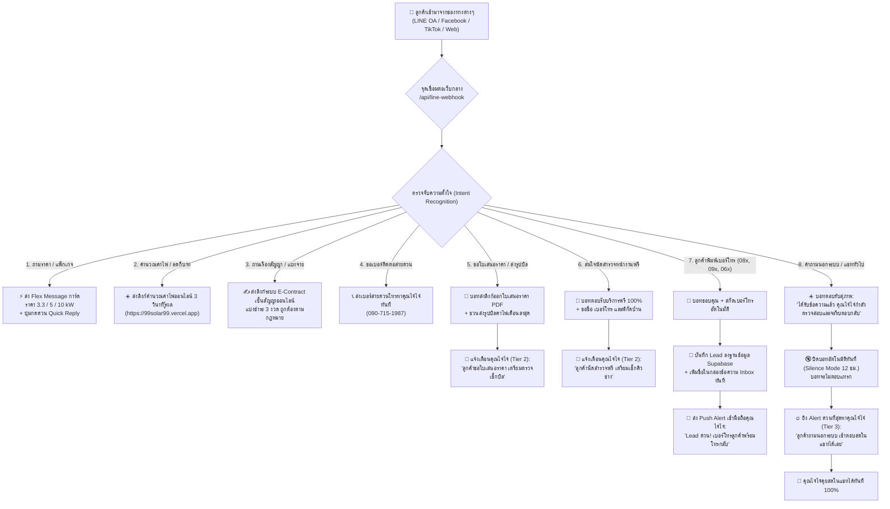

# ☀️ 99 SOLAR HAT YAI — Master Dialog Flow & Automation Blueprint
**บริษัท 99 แมทช์ เมคเกอร์ จำกัด (คุณไจ๋ไจ๋ 090-715-1987)**  
*เอกสารข้อตกลงและแผนผังไดอะล็อกโฟลว์การทำงานของแชทบอท & การส่งต่อข้อมูลฉบับละเอียด 100%*

---

## 📌 สรุปเป้าหมายร่วมกัน (Core Alignment)

> [!IMPORTANT]
> **หลักการทำงาน:**  
> 1. **"เว็บกลางอันเดียว"** รับข้อมูลจากทุกเพจ (Facebook, LINE, TikTok) ผ่าน Webhook กลางตัวเดียว ไม่ต้องเปิดหลายหน้าต่าง  
> 2. **"บอทตอบแทน 80% — คุณไจ๋ไจ๋คุยเฉพาะ 20% ที่เป็นเงินเป็นทอง"**  
> 3. **"ไม่เพิ่มภาระงานให้คุณไจ๋ไจ๋"** ระบบมีฟังก์ชันส่วนขยาย (Extensions) ดึงเบอร์โทร บันทึกลงฐานข้อมูล ส่งการ์ดราคา และปิดบอทให้อัตโนมัติเมื่อคนเข้าคุย

---

## 1. แผนผังภาพรวมไดอะล็อกโฟลว์ (Master Flowchart)

---

## 2. รายละเอียดโฟลว์บทสนทนาแบบแยกเคส (Detailed Dialog Specifications)

### 🟢 เคสที่ 1: ลูกค้าถามราคา หรือกดปุ่ม "แพ็กเกจราคา" ในริชเมนู
* **สิ่งที่ลูกค้าพิมพ์หรือกด:** `ราคา`, `แพ็กเกจ`, `เท่าไหร่`, `กี่บาท`, หรือกดช่อง B ในริชเมนู
* **สิ่งที่ระบบทำอัตโนมัติ:**
  1. ส่ง **Flex Message Mega Card** การ์ดหรูหรา 3 แพ็กเกจยอดนิยม:
     * 🔹 3.3 kW (ลดค่าไฟ ~1,800 บ./ด.) ➔ **119,000 บ.**
     * 🔹 5.0 kW (ลดค่าไฟ ~3,500 บ./ด.) ➔ **169,000 บ.** *(ขายดีที่สุด)*
     * 🔹 10.0 kW (ลดค่าไฟ ~7,000 บ./ด.) ➔ **289,000 บ.**
  2. แนบปุ่ม Quick Reply: `[📄 ขอใบเสนอราคา]` `[📍 นัดสำรวจฟรี]` `[📞 โทรหาไจ๋ไจ๋]`
* **การแจ้งเตือนหลังบ้าน:** ❌ ไม่แจ้งเตือน (เพราะบอทปิดการให้ข้อมูลได้สมบูรณ์ ไม่รบกวนคุณไจ๋ไจ๋)

---

### 🟡 เคสที่ 2: ลูกค้าขอใบเสนอราคา หรือส่งรูปบิลค่าไฟ
* **สิ่งที่ลูกค้าพิมพ์หรือกด:** `ขอใบเสนอราคา`, `เสนอราคา`, `ขอราคาบ้าน...`, ส่งรูปบิลค่าไฟ
* **สิ่งที่ระบบทำอัตโนมัติ:**
  1. บอทตอบทันที:
     > *"📄 ออกใบเสนอราคาทางการ (PDF A4 มีตราประทับ บจก. 99 แมทช์ เมคเกอร์):  
     > สามารถกรอกข้อมูลออกเอกสารออนไลน์ได้ทันทีที่: https://99solar99.vercel.app/quotation.html  
     > หรือส่ง 'รูปบิลค่าไฟเดือนล่าสุด' ทิ้งไว้ในแชทนี้ได้เลยครับ เดี๋ยวคุณไจ๋ไจ๋จัดทำใบเสนอราคาให้ทันทีครับ ⚡"*
  2. **ระบบแจ้งเตือนคุณไจ๋ไจ๋ (Tier 2 Push Alert):**
     > *"📋 [หมวด 2: ลูกค้าขอใบเสนอราคา]  
     > ข้อความลูกค้า: '[ข้อความจริงที่ลูกค้าพิมพ์]'  
     > เวลา: 10:30 น.  
     > สถานะ: บอทแนะนำส่งรูปบิลแล้ว คุณไจ๋ไจ๋เตรียมตรวจเช็กได้เลยครับ"*

---

### 🟡 เคสที่ 3: ลูกค้านัดสำรวจหน้างานฟรี
* **สิ่งที่ลูกค้าพิมพ์หรือกด:** `นัดสำรวจหน้างาน`, `เข้ามาดูหน้างานได้ไหม`, `สำรวจฟรีไหม`
* **สิ่งที่ระบบทำอัตโนมัติ:**
  1. บอทตอบทันที:
     > *"📍 99 Solar ให้บริการ 'สำรวจหน้างานฟรี 100%' ในเขตหาดใหญ่และสงขลาครับ!  
     > • วิศวกรตรวจเช็กทิศทางแดดและโครงสร้างหลังคา  
     > • ตรวจสอบตู้ไฟ MDB ก่อนยื่นขอ กฟภ. ไม่มีข้อผูกมัดใดๆ  
     > 📌 พิมพ์ 'ชื่อ + เบอร์โทร + พิกัดบ้าน' ทิ้งไว้ได้เลยครับ เดี๋ยวคุณไจ๋ไจ๋ติดต่อกลับนัดหมายทันทีครับ! ⚡"*
  2. **ระบบแจ้งเตือนคุณไจ๋ไจ๋ (Tier 2 Push Alert):**
     > *"📍 [หมวด 2: ลูกค้านัดสำรวจฟรี]  
     > ลูกค้าถาม: '[ข้อความจริง]'  
     > คุณไจ๋ไจ๋เตรียมดูคิวในตารางงานช่าง (เมนู 4) ได้เลยครับ"*

---

### 🟢 เคสที่ 4: ลูกค้าพิมพ์เบอร์โทรศัพท์ (Lead Auto-Capture)
* **สิ่งที่ลูกค้าพิมพ์:** มีตัวเลข 10 หลักขึ้นต้นด้วย 08x, 09x, 06x (เช่น `0819591122` หรือ `โทรมาเบอร์ 090-715-1987 นะ`)
* **สิ่งที่ระบบส่วนขยายทำอัตโนมัติ (คุณไจ๋ไจ๋ไม่ต้องทำอะไรเลย):**
  1. Regex Extractor สกัดเบอร์โทรออกมาได้แม่นยำ 100%
  2. บันทึกลงฐานข้อมูล `solar_leads` ใน Supabase ทันที
  3. เพิ่มรายการลงใน **กล่องข้อความ Inbox (เมนู 2)** และ **ตาราง Leads (เมนู 5)**
  4. บอทตอบลูกค้า:
     > *"☀️ ขอบพระคุณครับ 99 Solar บันทึกเบอร์โทร [เบอร์ที่สกัดได้] เรียบร้อยแล้วครับ! คุณไจ๋ไจ๋จะติดต่อกลับเพื่อให้คำแนะนำโดยเร็วที่สุดครับ ⚡"*
  5. **ยิงแจ้งเตือนด่วนเข้ามือถือคุณไจ๋ไจ๋:**
     > *"🚨 [Lead ด่วนพร้อมโทรกลับ!]  
     > เบอร์: 081-959-xxxx  
     > ข้อความเต็ม: '[ข้อความที่ลูกค้าพิมพ์]'  
     > 👉 คุณไจ๋ไจ๋กดโทรออกได้เลยครับ!"*

---

### 🔴 เคสที่ 5: คำถามนอกระบบ / ซับซ้อน / อยากคุยกับคน (Human Hand-off)
* **สิ่งที่ลูกค้าพิมพ์:** คำถามเทคนิคเฉพาะทาง เช่น *"ติดแอร์ 3 ตัวเปิดทั้งวันทั้งคืน ใช้แบตกี่กิโลวัตต์ แล้วถ้าไฟดับตู้เย็นจะดับไหม"*, หรือคำถามทั่วไปที่ไม่มีในระบบ
* **สิ่งที่ระบบทำอัตโนมัติ (จุดเด่นที่สุด):**
  1. บอทตอบรับสุภาพทันที:
     > *"☀️ ได้รับข้อความเรียบร้อยแล้วครับ!  
     > ทางคุณไจ๋ไจ๋ (ผู้จัดการ บจก. 99 แมทช์ เมคเกอร์) กำลังตรวจสอบข้อมูล และจะรีบตอบกลับข้อความนี้ด้วยตัวเองในสักครู่ครับ ⚡  
     > 🔹 สายด่วน: 090-715-1987"*
  2. **สั่งพักสายและปิดบอทอัตโนมัติ (Silence Mode):** บอทจะหยุดทำงานสำหรับลูกค้ารายนี้ 12 ชั่วโมงทันที บอทจะไม่ส่งข้อความแทรกเวลาคุณไจ๋ไจ๋คุย
  3. **ยิง Push Alert ด่วนที่สุดหาคุณไจ๋ไจ๋:**
     > *"🔥 [หมวด 3: ด่วนที่สุด! คำถามนอกระบบ - ต้องใช้คนตอบ]  
     > ลูกค้าพิมพ์ว่า: '[คำถามจริงของลูกค้า]'  
     > สถานะ: บอทพักสายและหยุดทำงานแล้ว  
     > 👉 คุณไจ๋ไจ๋เปิดแชทเข้าไปคุยสดได้เลยครับ!"*
  4. เมื่อคุณไจ๋ไจ๋คุยเสร็จ หากต้องการให้บอทกลับมาทำงาน พิมพ์คำสั่ง `#เปิดบอท` หรือ `#bot` ในแชทได้ทันทีครับ

---

## 3. สรุปฟังก์ชันส่วนขยาย (Extensions) ที่ระบบทำให้อัตโนมัติ

| ฟังก์ชันส่วนขยาย | สิ่งที่ระบบทำให้ (คุณไจ๋ไจ๋ไม่ต้องทำเอง) | ประโยชน์ที่ได้รับ |
| :--- | :--- | :--- |
| **1. Auto Phone Extractor** | จับเบอร์โทร 10 หลักจากข้อความลูกค้า แล้วยิงเข้าฐานข้อมูลทันที | ไม่ต้องนั่งคัดลอกเบอร์ ไม่ตกหล่น Lead |
| **2. Multi-Channel Central Webhook** | รวม Facebook ทุกเพจ + LINE + TikTok เข้ามาที่ลิงก์เดียว | ไม่ต้องเปิด 3-4 แอปเพื่อตรวจข้อความ |
| **3. Smart Silence Mode** | เมื่อลูกค้าถามเรื่องยาก บอทจะปิดตัวเองอัตโนมัติ 12 ชม. | คุณไจ๋ไจ๋คุยสดได้ลื่นไหล บอทไม่พูดแทรก |
| **4. Live Question Inbox** | สรุปข้อความว่า **"ลูกค้าถามมาว่าไง"** พร้อมสถานะในหน้าเดียว | เปิดหน้าเว็บดูได้ทันทีว่าใครรอคำตอบอยู่ |
| **5. One-Click Schedule Booking** | ฟอร์มเปิดรอบตารางงานช่าง พร้อมตรวจสภาพอากาศ | ลงคิวงานติดตั้ง 5 นาทีเสร็จ บันทึกจริง |
| **6. 2-Way Connection Hub** | มีทั้งลิงก์ดึงลูกค้าเข้า Landing Page และปุ่มส่งแคปชั่นไปโพสต์ | ทำการตลาดและปิดการขายครบวงจร |

---

## 4. แผนการตรวจสอบความเข้าใจ (Next Action)

คุณไจ๋ไจ๋สามารถตรวจเช็กความต้องการได้เลยครับ:
1. โฟลว์บทสนทนาและเกณฑ์การตอบแบบ 3 ระดับนี้ ตรงกับสไตล์การทำงานของคุณไจ๋ไจ๋ 100% แล้วหรือไม่ครับ?
2. มีข้อความตอบกลับ หรือแพ็กเกจโปรโมชั่นจุดไหนที่ต้องการให้ปรับคำพูดเพิ่มเติมหรือไม่ครับ?
