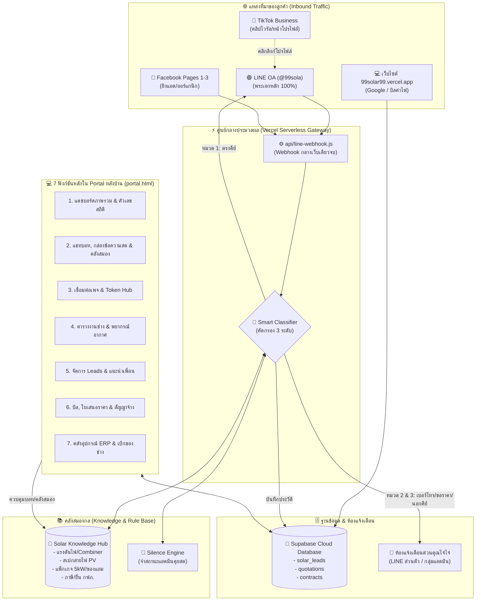
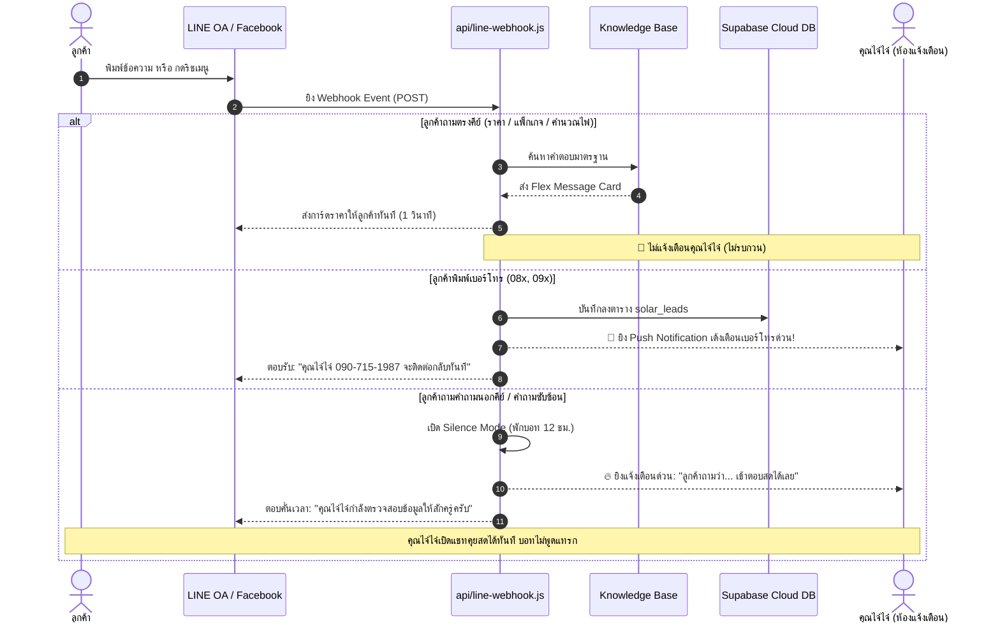

# ☀️ 99 SOLAR HAT YAI — MASTER PROJECT AUDIT & SYSTEM MANUAL
**บริษัท 99 แมทช์ เมคเกอร์ จำกัด (คุณไจ๋ไจ๋ 090-715-1987)**  
*คู่มือสำรวจทั้งโปรเจกต์: จัดหมวดหมู่ 7 ฟังก์ชันหลัก, 28 ฟีเจอร์ย่อย, ไดอะแกรมความสัมพันธ์, Flow การทำงาน และแผนงานโค้ดส่วนที่ขาด*

---

## 🏗️ 1. ผังไดอะแกรมสถาปัตยกรรมรวมทั้งระบบ (System Mega-Diagram)

---

## 📋 2. สำรวจ 7 ฟังก์ชันหลัก & 28 ฟีเจอร์ย่อยหลังบ้าน (Feature Breakdown)

| ฟังก์ชันหลัก | ลำดับ | ฟีเจอร์ย่อย (Features) | สถานะปัจจุบัน | ความสำคัญต่อธุรกิจ |
| :--- | :---: | :--- | :---: | :---: |
| **ฟังก์ชันที่ 1: แดชบอร์ดภาพรวม** | 1.1 | สรุปยอดขาย & ตัวเลข Lead รายเดือน | ✅ พร้อมใช้ | สูง |
| | 1.2 | นับจำนวนคิวงานช่างรอติดตั้ง | ✅ พร้อมใช้ | กลาง |
| | 1.3 | สถานะการเชื่อมต่อ Webhook & Database สด | ✅ พร้อมใช้ | สูง |
| | 1.4 | วิดเจ็ตพยากรณ์อากาศหาดใหญ่แบบย่อ | ✅ พร้อมใช้ | ปานกลาง |
| **ฟังก์ชันที่ 2: แชทบอท & กล่องข้อความ** | 2.1 | **Live Question Inbox** (ดูสดว่าลูกค้าพิมพ์อะไร) | ✅ พร้อมใช้ | **วิกฤต (A+)** |
| | 2.2 | **Smart Notification** แยก 3 หมวด (ไม่เตือน / เตือน / ด่วน) | ✅ พร้อมใช้ | **วิกฤต (A+)** |
| | 2.3 | **Solar Knowledge Base Manager** (เพิ่มความรู้ให้บอท) | ✅ พร้อมใช้ | **วิกฤต (A+)** |
| | 2.4 | **Rich Menu Visualizer** (เทมเพลต 6 ปุ่ม & ดูพิกัด) | ✅ พร้อมใช้ | สูง |
| | 2.5 | **Flex Card Preview & Chat Simulator** (ซ้อมคุยสด) | ✅ พร้อมใช้ | สูง |
| **ฟังก์ชันที่ 3: จัดการเพจ & Token Hub** | 3.1 | รวมศูนย์ลิงก์ Webhook กลางอันเดียวจบ | ✅ พร้อมใช้ | **วิกฤต (A+)** |
| | 3.2 | กล่องใส่ Token LINE OA & Meta Facebook Pages | ✅ พร้อมใช้ | สูง |
| | 3.3 | กล่องระบุ LINE User ID คุณไจ๋ไจ๋ สำหรับรับเตือนด่วน | ✅ พร้อมใช้ | สูง |
| | 3.4 | สวิตช์เปิด/ปิดบอทรายเพจ และปุ่มเพิ่มเพจใหม่ | ✅ พร้อมใช้ | ปานกลาง |
| **ฟังก์ชันที่ 4: ตารางช่าง & พยากรณ์อากาศ** | 4.1 | โมดอลเปิดรอบงานติดตั้ง / นัดสำรวจหน้างานฟรี | ✅ พร้อมใช้ | สูง |
| | 4.2 | ตารางแสดงคิวงาน แบ่งทีมช่าง A / ทีมวิศวกร B | ✅ พร้อมใช้ | สูง |
| | 4.3 | ตรวจสอบแดด/ฝนหาดใหญ่ก่อนขึ้นหลังคา | ✅ พร้อมใช้ | สูง |
| | 4.4 | ปุ่มเปลี่ยนสถานะงาน (รอตรวจ -> ติดตั้งเสร็จ) | ✅ พร้อมใช้ | สูง |
| **ฟังก์ชันที่ 5: Leads & แนะนำเพื่อน** | 5.1 | ตารางรายชื่อลูกค้า ดึงจาก Supabase อัตโนมัติ | ✅ พร้อมใช้ | สูง |
| | 5.2 | ปุ่มคลิกโทรออกหาลูกค้าทันที (`tel:xxx`) | ✅ พร้อมใช้ | สูง |
| | 5.3 | ระบบคำนวณค่าคอมมิชชันแนะนำเพื่อน (3,000 บ./เคส) | ✅ พร้อมใช้ | ปานกลาง |
| | 5.4 | ตัวกรองสถานะลูกค้า (ใหม่ / ติดต่อแล้ว / ปิดการขาย) | ✅ พร้อมใช้ | ปานกลาง |
| **ฟังก์ชันที่ 6: บิล ใบเสนอราคา & สัญญา** | 6.1 | ออกใบเสนอราคาทางการ PDF A4 มีตราบริษัท (`quotation.html`) | ✅ พร้อมใช้ | **วิกฤต (A+)** |
| | 6.2 | สัญญาจ้างติดตั้งออนไลน์ E-Contract แบ่ง 3 งวด (`contract.html`) | ✅ พร้อมใช้ | **วิกฤต (A+)** |
| | 6.3 | คำนวณภาษี VAT 7% และสิทธิ BOI ลดหย่อนภาษี | ✅ พร้อมใช้ | สูง |
| | 6.4 | บันทึกประวัติใบเสนอราคาลงฐานข้อมูล Supabase | ✅ พร้อมใช้ | สูง |
| **ฟังก์ชันที่ 7: คลังสต็อก & เบิกจ่าย ERP** | 7.1 | สรุปสต็อก Inverter Huawei / แผง JA Solar / Deye | ✅ พร้อมใช้ | ปานกลาง |
| | 7.2 | ระบบใบขอราคาอะไหล่ซัพพลายเออร์ RFQ (`parts-rfq.html`) | ✅ พร้อมใช้ | ปานกลาง |
| | 7.3 | ระบบตัดสต็อกเมื่อช่างเบิกของไปหน้างาน | ✅ พร้อมใช้ | ปานกลาง |
| | 7.4 | เชื่อมต่อระบบ ERP ฉบับเต็ม (`solar-erp.html`) | ✅ พร้อมใช้ | ปานกลาง |

---

## 🔄 3. แผนผังโฟลว์การทำงานจริง (Operational Step-by-Step Flow)

### โฟลว์ ก: ลูกค้าทักแชทสอบถาม (Chat Inbound Flow)

---

## 🛠️ 4. ตรวจสอบ "สิ่งที่ยังขาด" และแนวทางเขียนโค้ดเติมเต็ม (Missing Gaps & Implementation Plan)

จากการสำรวจอย่างละเอียด มี **3 จุดสำคัญที่ต้องเสริมโค้ด** เพื่อให้ระบบสมบูรณ์แบบ 100%:

### จุดที่ขาด 1: ฟังก์ชันยิงข้อความอัปเดตสถานะงานกลับหาลูกค้า (Customer Status Push)
* **ปัญหา:** ตอนนี้ใน `portal.html` มีปุ่มเปลี่ยนสถานะงาน (เช่น อนุมัติใบเสนอราคา, นัดวันติดตั้งสำเร็จ) แต่ยังไม่ได้ส่งข้อความ LINE กลับไปบอกลูกค้าในห้อง 1 โดยอัตโนมัติ
* **การแก้ไข:** เขียนฟังก์ชัน `pushStatusUpdateToCustomer(userId, statusText)` เพิ่มใน `api/line-webhook.js` เพื่อให้เวลากดอัปเดตงานในหน้า Portal จะมีข้อความเด้งไปบอกลูกค้าทันทีเหมือนแอปช้อปปิ้ง

### จุดที่ขาด 2: การดึง Knowledge Base จาก Supabase มาเสริม Webhook แบบ Realtime
* **ปัญหา:** ปัจจุบัน Knowledge Base ใน `api/line-webhook.js` มีชุดข้อมูลโค้ดฝังไว้ 8 หมวด และใน `portal.html` มี LocalStorage หากต้องการให้เวลาคุณไจ๋ไจ๋พิมพ์เพิ่มในหน้าเว็บแล้วบอทในเซิร์ฟเวอร์จำได้ทันที ควรเชื่อมตาราง `solar_knowledge` ใน Supabase
* **การแก้ไข:** เพิ่มตาราง `solar_knowledge` ใน `supabase-schema.sql` และให้ Webhook ดึงคำตอบจาก Supabase ก่อนตอบลูกค้า

### จุดที่ขาด 3: ลิงก์ตรงจากห้องแจ้งเตือนคุณไจ๋ไจ๋ (Deep Link Action)
* **ปัญหา:** เวลาบอทส่งข้อความแจ้งเตือนคุณไจ๋ไจ๋เข้าห้องที่ 2 ยังเป็นข้อความตัวหนังสือธรรมดา
* **การแก้ไข:** ปรับข้อความ Push Notification ให้มีปุ่มกด เช่น `[📞 โทรออกทันที]` หรือ `[เปิดดูใบเสนอราคา]` เพื่อให้คุณไจ๋ไจ๋แตะบนหน้าจอแล้วทำงานต่อได้ใน 1 วินาที
